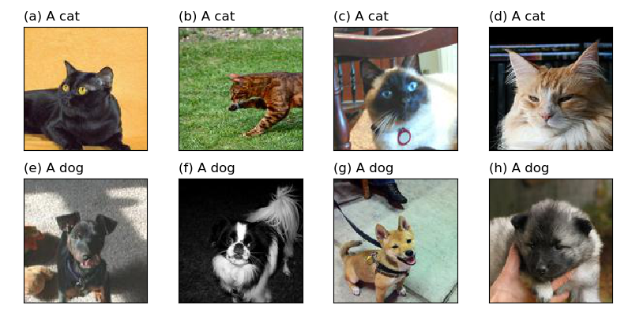

# Cats and dogs

A small and simple data set containing images of cats and dogs. It is based on the [Oxford-IIIT Pet Dataset](https://www.robots.ox.ac.uk/~vgg/data/pets/).

## Accessing the data

```
from catsndogs import training
from catsndogs import test
import glob
import os

training_folders = glob.glob(os.path.join(training.folder, "*"))
print("Folders with training images: ", training_folders)

folders = glob.glob(os.path.join(training.folder, "*"))
print("Folders with test images: ", test_folders)
```



